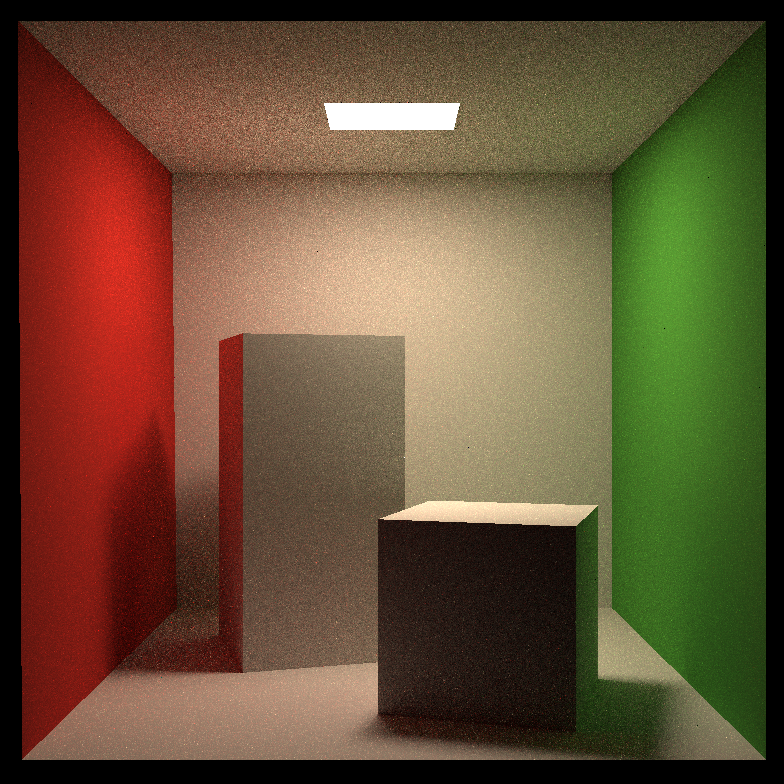
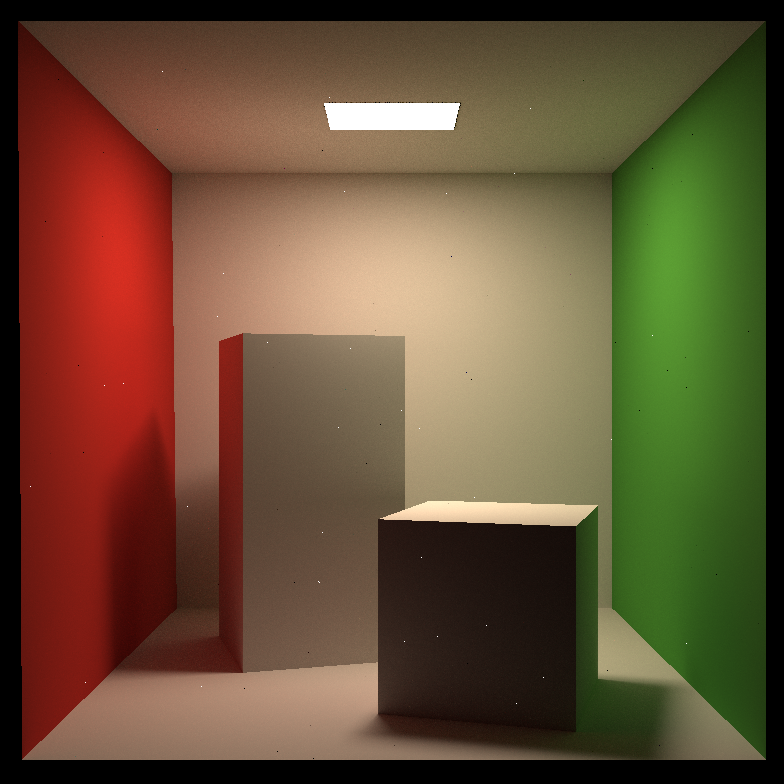

# Naive Path Tracing

This project implements path tracing algorithm that renders diffuse materials only. In the future, introduce specular and microfacet materials would make the algorithm renders more types of materials.

## Build with CMake and GCC

In order to manage build files easily, create another directory like `build`, then `cd` into the directory and execute the following commands:

```bash
cmake ..
make
```

The multi-threading implementation is based on `std::thread`, which is from `pthread` library, which is not in gcc standard library; so the library needs to be explicitly linked into the project:

```c
target_link_libraries(RayTracing pthread)
```

In Linux, the random number generator might not work sue to gcc issue. if encountering exception related random seed like `rdseed`, go to file `global.hpp`, find function `get_random_float` and change the first line to force device type:

```cpp
std::random_device dev("rdrand");
```

## Build with Visual Studio 2019

Include all source file into project accordingly, add flag `_CRT_SECURE_NO_WARNINGS` and force C++ standard to `C++ 17`.

## Benchmarking

Due to overheat protection, CPU performance might be slower that expected on personal PC.

### Personal PC Benchmarking (Core i5-8265U, 1.60 GHz, 8 cores)

| Number of Threads | SPP | Runtime (minutes) | Runtime (seconds) |
|:-----------------:|:---:|:-----------------:|:-----------------:|
|         1         |  16 |         7         |         -         |
|         8         |  16 |         1         |         80        |
|         8         |  32 |         2         |        165        |
|         8         |  64 |         6         |        368        |
|         8         | 128 |         12        |        721        |
|         8         | 256 |         24        |        1465       |

### Server Benchmarking (Xeon Gold 6242, 2.80 GHz, 32 cores, render at 32 threads)

|  SPP | Runtime (minutes) | Runtime (seconds) |
|:----:|:-----------------:|:-----------------:|
|  16  |         0         |         17        |
|  32  |         0         |         31        |
|  64  |         1         |         65        |
|  128 |         2         |        124        |
|  256 |         4         |        285        |
|  512 |         7         |        479        |
| 1024 |         15        |        946        |
| 2048 |         30        |        1857       |

## Render Result Reference

The following gallery displays resulting image under different SPP settings.

### 16 SPP


### 32 SPP


### 64 SPP


### 128 SPP


### 256 SPP


### 1024 SPP


### 2048 SPP

